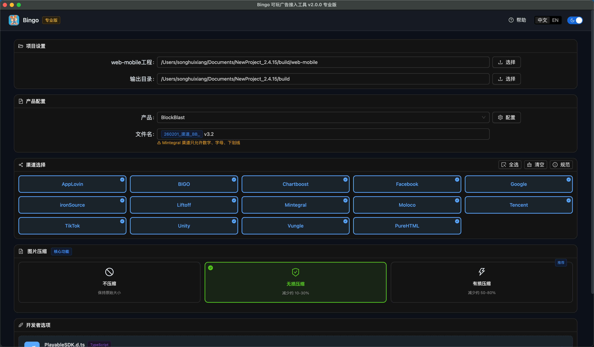
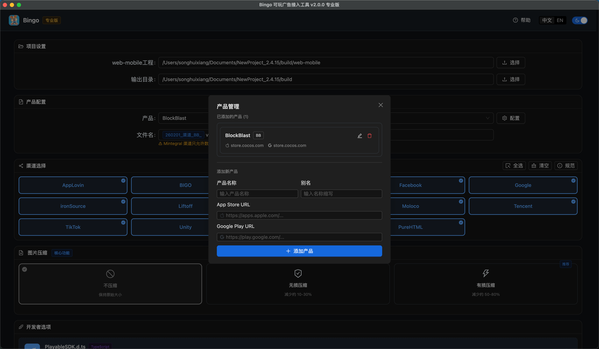
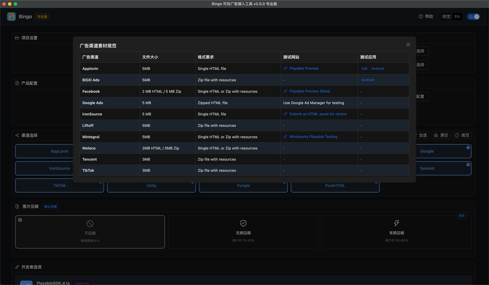
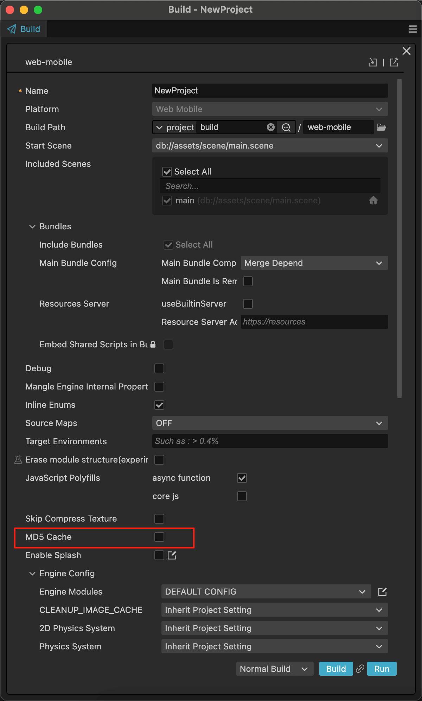

<p align="center">
  
</p>

> 🇺🇸 For English users, please refer to [README_EN.md](./README_EN.md) for the English version

# Bingo 可玩广告构建工具

## 让广告开发更简单高效

Bingo 是一款专为广告开发者打造的跨平台桌面应用程序，它能帮助您快速构建、测试和发布跨平台的 Playable 可玩广告。无论您是面向 Facebook、Unity、AppLovin 还是其他主流广告平台，Bingo 都能为您提供一站式解决方案。

## 核心价值

✅ 多平台支持 - 内置 14 个主流广告平台 SDK 集成，无需重复开发

   - AppLovin、BIGO、Chartboost、Facebook、Google
   - ironSource、Liftoff、Mintegral、Moloco、PureHTML
   - Tencent、TikTok、Unity、Vungle  
 
✅ 一键构建 - 自动化打包流程，告别繁琐的手动操作  
✅ 专属功能 - 高级压缩选项，优化广告包体积和性能  
✅ 直观界面 - 简洁易用的操作界面，支持中英文界面切换，降低学习成本  
✅ 本地测试 - 内置预览功能，快速验证包体大小

## 使用场景

🎮 **游戏开发者** - 为您的游戏快速创建可玩广告，提高用户转化率  
📱 **广告代理商** - 同时管理多个客户项目的广告构建需求  
🏆 **独立开发者** - 无需搭建复杂环境，个人电脑即可完成专业级广告开发

## 系统要求

✅ 支持 Windows 和 macOS 操作系统（仅支持 Apple Silicon M1/M2/M3/M4 芯片）  
✅ 支持 Cocos Creator 版本:
   - 2.4.11 及以上版本
   - 3.8.0 及以上版本

✅ 全面支持 2D 和 3D 游戏开发  
✅ 完全兼容 Cocos Creator 所有功能模块

## 获取 Bingo

### 体验版本

[获取 GitHub 体验版](https://github.com/songhuixiang/playable-demo/releases) - 下载最新的体验版本，抢先体验新功能

### 正式版本

[立即获取 Bingo 应用](https://store.cocos.com/app/detail/7593) - 前往 Cocos 商店购买和下载

> 💡 **版本更新说明**：由于 Cocos 商店审核周期较长，商店版本可能会有一定滞后。如果您发现商店版本不是最新版本，可以直接购买后凭支付记录截图，通过邮箱（458264325@qq.com）或微信联系我们获取与体验版相同的最新版本。

## 界面展示



_简洁直观的主界面，支持亮色/暗色主题和中英文界面切换，一键完成广告构建_


_高效管理多个广告项目的产品界面_

-   **添加产品**：支持快速导入新广告项目，轻松管理多个项目
-   **删除产品**：一键移除不再需要的项目，保持工作区整洁
-   **产品设置**：自定义产品名称、别名和平台 URL


_一目了然的广告渠道素材规范界面_

-   **平台要求**：展示各大广告平台的素材规范，包括文件大小限制和格式要求
-   **测试工具**：提供各平台的测试工具链接，方便快速验证广告素材
-   **应用预览**：支持在测试应用中预览广告效果

## 快速入门

只需 4 步，即可完成可玩广告的构建：

### 第 1 步：在 Cocos Creator 中构建项目

1. 打开您的 Cocos Creator 项目
2. 选择菜单「项目」→「构建发布」
3. 目标平台选择「Web Mobile」
4. ⚠️ **重要**：确保不勾选「MD5 Cache」选项
5. 点击「构建」按钮，等待构建完成

### 第 2 步：配置项目路径

1. 打开 Bingo 应用
2. 点击「选择」按钮，选择上一步生成的 `web-mobile` 目录
3. 点击「选择」按钮，指定输出目录（构建后的广告文件将保存在此处）

### 第 3 步：配置产品信息

1. 点击产品旁的「设置」按钮打开产品管理界面
2. 添加或选择您的产品
3. 配置产品的 Apple Store 和 Google Play 商店链接（用于广告跳转）

### 第 4 步：选择渠道并构建

1. 在渠道列表中勾选目标广告平台（可多选）
2. 根据需要选择图片压缩模式：
   - **无压缩**：保持原始画质
   - **无损压缩**：转换为 WebP 格式，画质无损失
   - **有损压缩**：可调节质量参数，获得更小的包体
3. 点击「构建」按钮
4. 构建完成后，在输出目录中查看生成的广告文件

> 💡 **提示**：部分渠道（如 Facebook、Google、TikTok）会输出 ZIP 包，其他渠道输出单个 HTML 文件。

## 图片压缩功能

Bingo 内置了强大的图片压缩引擎，可以有效减小广告包体积，帮助您满足各平台的文件大小限制。

### 压缩模式对比

| 模式 | 技术方案 | 压缩效果 | 画质影响 | 推荐场景 |
|------|---------|---------|---------|---------|
| 无压缩 | 保持原始格式 | 无 | 无损失 | 包体已满足要求，追求原始画质 |
| 无损压缩 | PNG/JPG → WebP | 约 20-40% | 无损失 | 平衡画质与体积 |
| 有损压缩 | WebP + 质量控制 | 约 50-80% | 轻微损失 | 需要极致压缩以满足平台限制 |

### 有损压缩质量参数

使用有损压缩时，您可以通过滑块调节质量参数（1-100）：

- **100%**：最高画质，压缩率较低
- **50%**（推荐）：平衡画质与体积
- **1%**：最小体积，画质损失较大

### 智能优化

Bingo 会自动对比压缩前后的文件大小：
- 如果压缩后体积**更小**，使用压缩版本
- 如果压缩后体积**反而变大**，自动保留原图

这确保了压缩操作始终是有益的，不会因为压缩导致包体变大。

## SDK 接入说明

在使用 Bingo 工具前，需要在项目中接入 [PlayableSDK.d.ts](./PlayableSDK.d.ts)，该 SDK 提供以下主要接口：

### 核心接口

#### 1. `download()` - 跳转应用商店
当用户点击下载按钮（CTA）或结束卡片时调用此方法，触发应用商店跳转。

#### 2. `game_end()` - 游戏结束通知
当游戏结束时（无论胜利或失败）必须调用此方法。

> ⚠️ **重要**：某些广告平台（如 Mintegral、Vungle）**强制要求**调用此方法，否则可能导致广告行为异常或统计数据不准确。

#### 3. `channel` - 获取当前渠道（只读）
获取当前运行的广告渠道，可用于实现渠道差异化逻辑：

```typescript
// 根据不同渠道显示不同内容
if (PlayableSDK.channel === 'Facebook') {
    // Facebook 特定逻辑
} else if (PlayableSDK.channel === 'TikTok') {
    // TikTok 特定逻辑
}
```

### 生命周期回调接口

#### 4. `onMute(callback)` / `onUnmute(callback)` - 音频控制
注册静音/取消静音回调函数，用于响应平台的音频控制请求。

#### 5. `onPause(callback)` / `onResume(callback)` - 暂停/恢复
注册暂停/恢复回调函数。以下场景会触发这些回调：

| 回调 | 触发场景 |
|------|---------|
| `onPause` | 用户点击下载按钮跳转商店、广告进入后台、广告失去焦点 |
| `onResume` | 用户从商店返回、广告回到前台、广告重新获得焦点 |

**最佳实践**：
- 在 `onPause` 中暂停游戏动画、音效和计时器
- 在 `onResume` 中恢复游戏状态，或考虑直接显示结束卡片

### 完整示例：

```typescript
// 注册生命周期回调
PlayableSDK.onMute(() => {
    // 静音游戏音效
    AudioManager.muteAll();
});

PlayableSDK.onUnmute(() => {
    // 恢复游戏音效
    AudioManager.unmuteAll();
});

PlayableSDK.onPause(() => {
    // 暂停游戏
    GameManager.pause();
});

PlayableSDK.onResume(() => {
    // 恢复游戏
    GameManager.resume();
});
```

## 重要配置说明

### 打包配置注意事项

**⚠️ 重要提示：在使用 Cocos Creator 打包项目时，请务必不要勾选 "MD5 Cache" 选项**



勾选 MD5 Cache 会导致可玩广告在某些平台上无法正常运行，因为：
- MD5 缓存会改变资源文件的命名规则
- 部分广告平台对文件名有严格要求
- 可能导致资源加载失败或路径错误

**正确做法：** 在构建设置中确保 "MD5 Cache" 选项保持未勾选状态。

### 平台测试注意事项

**⚠️ 关于 `document.write()` 的兼容性问题**

部分用户在 AppLovin 等平台的测试工具中测试可玩广告时，可能会遇到广告无法正常显示的问题。这通常是由于现代浏览器（Chrome 55+）对 `document.write()` 方法有更严格的限制，控制台可能会显示 `Violation` 警告。

**解决方案：**
- 使用 **Chrome 无痕模式**（Ctrl/Cmd + Shift + N）打开平台测试工具，通常可以正常显示
- 尝试使用其他浏览器进行测试（如 Safari），因为不同浏览器对 `document.write()` 的限制程度不同
- 如果在平台测试工具中无法显示，请尝试在本地浏览器中直接打开 HTML 文件进行测试

## 构建结果示例

[查看 Bingo 生成的可玩广告示例](./build/playables) - 这些是通过 Bingo 工具生成的跨平台广告素材

## 用户评价

"使用 Bingo 后，我们的广告构建时间从 2 小时缩短到 10 分钟，团队效率提升了 90%！" - 某知名游戏公司技术总监

"作为一个独立开发者，Bingo 让我能够以极低成本制作出专业水准的可玩广告。" - 独立游戏制作人

## 联系我们

如有任何问题或需求反馈，欢迎通过以下方式联系我：

-   email: 458264325@qq.com
-   微信

    
