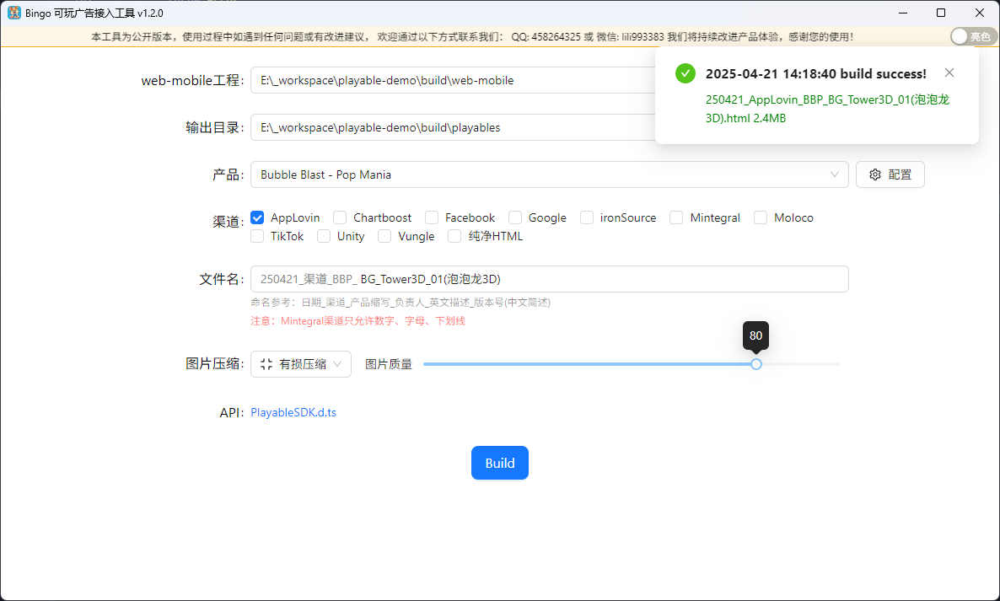
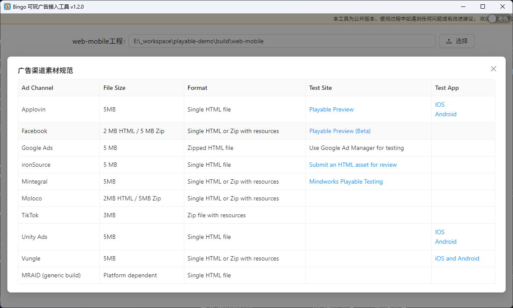

<p align="center">
  
</p>

> 🇺🇸 For English users, please refer to [README_EN.md](./README_EN.md) for the English version

# Bingo 可玩广告构建工具

## 让广告开发更简单高效

Bingo 是一款专为广告开发者打造的跨平台桌面应用程序，它能帮助您快速构建、测试和发布跨平台的 Playable 可玩广告。无论您是面向 Facebook、Unity、AppLovin 还是其他主流广告平台，Bingo 都能为您提供一站式解决方案。

## 核心价值

✅ 多平台支持 - 内置 14 个主流广告平台 SDK 集成，无需重复开发

   - AppLovin、BIGO、Chartboost、Facebook、Google
   - ironSource、Liftoff、Mintegral、Moloco、PureHTML
   - Tencent、TikTok、Unity、Vungle  
 
✅ 一键构建 - 自动化打包流程，告别繁琐的手动操作  
✅ 专属功能 - 高级压缩选项，优化广告包体积和性能  
✅ 直观界面 - 简洁易用的操作界面，支持中英文界面切换，降低学习成本  
✅ 本地测试 - 内置预览功能，快速验证包体大小

## 系统要求

✅ 支持 Windows 和 macOS 操作系统（仅支持 Apple Silicon M1/M2/M3/M4 芯片）  
✅ 支持 Cocos Creator 版本: 3.8.0 - 3.8.6  
✅ 全面支持 2D 和 3D 游戏开发  
✅ 完全兼容 Cocos Creator 所有功能模块

## 界面展示



_简洁直观的主界面，支持亮色/暗色主题和中英文界面切换，一键完成广告构建_


_高效管理多个广告项目的产品界面_

-   **添加产品**：支持快速导入新广告项目，轻松管理多个项目
-   **删除产品**：一键移除不再需要的项目，保持工作区整洁
-   **产品设置**：自定义产品名称、别名和平台 URL


_一目了然的广告渠道素材规范界面_

-   **平台要求**：展示各大广告平台的素材规范，包括文件大小限制和格式要求
-   **测试工具**：提供各平台的测试工具链接，方便快速验证广告素材
-   **应用预览**：支持在测试应用中预览广告效果

## SDK 接入说明

在使用 Bingo 工具前，需要在项目中接入 [PlayableSDK.d.ts](./PlayableSDK.d.ts)，该 SDK 提供以下主要接口：

### 核心接口
1. `download()` - 当用户点击下载按钮时调用此方法
2. `game_end()` - 当游戏结束时（无论胜利或失败）必须调用此方法
3. `channel` - 获取当前运行的广告渠道（只读属性）

### 生命周期回调接口
4. `onMute(callback)` - 注册静音回调函数
5. `onUnmute(callback)` - 注册取消静音回调函数
6. `onPause(callback)` - 注册暂停回调函数
7. `onResume(callback)` - 注册恢复回调函数

### 基础用法示例：

```typescript
try {
    PlayableSDK.download(); // 下载按钮点击事件
    PlayableSDK.game_end(); // 游戏结束时调用
    
    // 获取当前广告渠道
    console.log('当前渠道:', PlayableSDK.channel);
} catch (error) {
    console.warn(error);
}
```

### 生命周期管理示例：

```typescript
// 注册生命周期回调
PlayableSDK.onMute(() => {
    // 静音游戏音效
    AudioManager.muteAll();
});

PlayableSDK.onUnmute(() => {
    // 恢复游戏音效
    AudioManager.unmuteAll();
});

PlayableSDK.onPause(() => {
    // 暂停游戏
    GameManager.pause();
});

PlayableSDK.onResume(() => {
    // 恢复游戏
    GameManager.resume();
});
```

## 重要配置说明

### 打包配置注意事项

**⚠️ 重要提示：在使用 Cocos Creator 打包项目时，请务必不要勾选 "MD5 Cache" 选项**


勾选 MD5 Cache 会导致可玩广告在某些平台上无法正常运行，因为：
- MD5 缓存会改变资源文件的命名规则
- 部分广告平台对文件名有严格要求
- 可能导致资源加载失败或路径错误

**正确做法：** 在构建设置中确保 "MD5 Cache" 选项保持未勾选状态。

## 它能解决您的哪些痛点？

1. 平台适配繁琐 - 不同广告平台有不同的 SDK 要求，Bingo 已为您内置所有适配代码
2. 构建流程复杂 - 从原始项目到最终广告包，只需点击几次鼠标
3. 测试效率低下 - 本地即可完成基本功能验证，减少云端测试次数
4. 团队协作困难 - 统一构建标准，确保不同成员产出的一致性

## 使用场景

🎮 游戏开发者 - 为您的游戏快速创建可玩广告，提高用户转化率  
📱 广告代理商 - 同时管理多个客户项目的广告构建需求  
🏆 独立开发者 - 无需搭建复杂环境，个人电脑即可完成专业级广告开发

## 体验版本

[获取 GitHub 体验版](https://github.com/songhuixiang/playable-demo/releases) - 下载最新的体验版本，抢先体验新功能

## 立即下载

[立即获取 Bingo 应用](https://store.cocos.com/app/detail/7593) - 前往 Cocos 商店购买和下载

## 构建结果示例

[查看 Bingo 生成的可玩广告示例](./build/playables) - 这些是通过 Bingo 工具生成的跨平台广告素材

## 用户评价

"使用 Bingo 后，我们的广告构建时间从 2 小时缩短到 10 分钟，团队效率提升了 90%！" - 某知名游戏公司技术总监

"作为一个独立开发者，Bingo 让我能够以极低成本制作出专业水准的可玩广告。" - 独立游戏制作人

## 联系我们

如有任何问题或需求反馈，欢迎通过以下方式联系我：

-   email: 458264325@qq.com
-   微信

    
