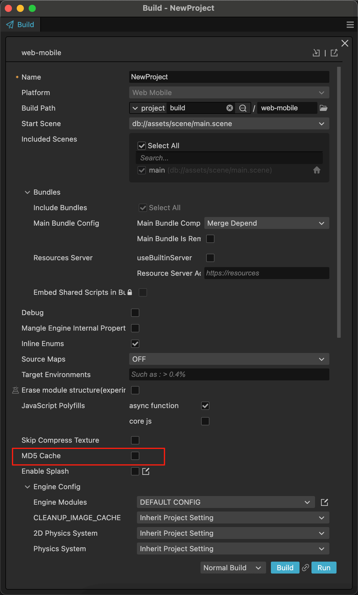

<p align="center">
  
</p>

> 🇨🇳 For Chinese users, please refer to [README.md](./README.md) for the Chinese version.

# Bingo Playable Ads Builder

## Make Ad Development Easier and More Efficient

Bingo is a cross-platform desktop application specifically designed for advertising developers, helping you quickly build, test, and publish cross-platform Playable ads. Whether you're targeting Facebook, Unity, AppLovin, or other mainstream advertising platforms, Bingo provides you with a one-stop solution.

## Core Values

✅ Multi-platform Support - Built-in integration with 14 mainstream ad platform SDKs, no need for repeated development

   - AppLovin, BIGO, Chartboost, Facebook, Google
   - ironSource, Liftoff, Mintegral, Moloco, PureHTML
   - Tencent, TikTok, Unity, Vungle  

✅ One-click Build - Automated packaging process, say goodbye to tedious manual operations  
✅ Exclusive Features - Advanced compression options to optimize ad package size and performance  
✅ Intuitive Interface - Simple and easy-to-use UI with Chinese/English language switching, reducing the learning curve  
✅ Local Testing - Built-in preview function for quick validation of package size

## System Requirements

✅ Supports Windows and macOS operating systems (only supports Apple Silicon M1/M2/M3/M4 chips)  
✅ Supports Cocos Creator versions: 3.8.0 - 3.8.7  
✅ Full support for 2D and 3D game development  
✅ Fully compatible with all Cocos Creator feature modules

## UI Showcase


_Simple and intuitive main interface, supports light/dark themes and Chinese/English language switching, one-click ad building_


_Efficiently manage multiple ad projects_

-   **Add Product**: Quickly import new ad projects and easily manage multiple projects
-   **Delete Product**: Remove unnecessary projects with one click to keep your workspace tidy
-   **Product Settings**: Customize product name, alias, and platform URL


_Clear overview of ad channel material specifications_

-   **Platform Requirements**: Display material specs for major ad platforms, including file size limits and format requirements
-   **Testing Tools**: Provide links to testing tools for each platform for quick ad material validation
-   **App Preview**: Support previewing ad effects in the test app

## SDK Integration Guide

Before using the Bingo tool, you need to integrate [PlayableSDK.d.ts](./PlayableSDK.d.ts) into your project. This SDK provides the following main interfaces:

### Core Interfaces
1. `download()` - Call this method when the user clicks the download button
2. `game_end()` - Must be called when the game ends (whether win or lose)
3. `channel` - Get the current advertising channel (read-only property)

### Lifecycle Callback Interfaces
4. `onMute(callback)` - Register mute callback function
5. `onUnmute(callback)` - Register unmute callback function
6. `onPause(callback)` - Register pause callback function
7. `onResume(callback)` - Register resume callback function

### Basic Usage Example:

```typescript
try {
    PlayableSDK.download(); // Download button click event
    PlayableSDK.game_end(); // Call when the game ends
    
    // Get current advertising channel
    console.log('Current channel:', PlayableSDK.channel);
} catch (error) {
    console.warn(error);
}
```

### Lifecycle Management Example:

```typescript
// Register lifecycle callbacks
PlayableSDK.onMute(() => {
    // Mute game audio
    AudioManager.muteAll();
});

PlayableSDK.onUnmute(() => {
    // Unmute game audio
    AudioManager.unmuteAll();
});

PlayableSDK.onPause(() => {
    // Pause the game
    GameManager.pause();
});

PlayableSDK.onResume(() => {
    // Resume the game
    GameManager.resume();
});
```

## Important Configuration Notes

### Build Configuration Precautions

**⚠️ Important Notice: When building your project with Cocos Creator, please make sure NOT to check the "MD5 Cache" option**



Checking MD5 Cache can cause playable ads to malfunction on certain platforms because:
- MD5 caching changes the naming convention of resource files
- Some ad platforms have strict requirements for file names
- May cause resource loading failures or path errors

**Correct approach:** Ensure the "MD5 Cache" option remains unchecked in the build settings.

## What Problems Does It Solve for You?

1. Tedious platform adaptation - Different ad platforms have different SDK requirements, Bingo has built-in all adaptation code for you
2. Complex build process - From the original project to the final ad package, just a few clicks
3. Low testing efficiency - Basic function verification can be completed locally, reducing cloud testing times
4. Difficult team collaboration - Unified build standards ensure consistency in output from different members

## Use Cases

🎮 Game Developers - Quickly create playable ads for your games to improve user conversion rates  
📱 Ad Agencies - Manage ad building needs for multiple client projects simultaneously  
🏆 Indie Developers - No need to set up a complex environment, professional-grade ad development can be done on a personal computer

## Trial Version

[Get GitHub Trial Version](https://github.com/songhuixiang/playable-demo/releases) - Download the latest trial version to experience new features first

## Download Now

[Get Bingo App Now](https://store.cocos.com/app/detail/7593) - Go to Cocos Store to purchase and download

## Example Build Results

[View Playable Ad Examples Generated by Bingo](./build/playables) - These are cross-platform ad materials generated by the Bingo tool

## User Testimonials

"After using Bingo, our ad build time was reduced from 2 hours to 10 minutes, and team efficiency increased by 90%!" - Technical Director of a well-known game company

"As an indie developer, Bingo allows me to create professional-quality playable ads at a very low cost." - Indie Game Producer

## Contact Us

If you have any questions or feedback, feel free to contact me via:

-   email: 458264325@qq.com
-   WeChat

    
